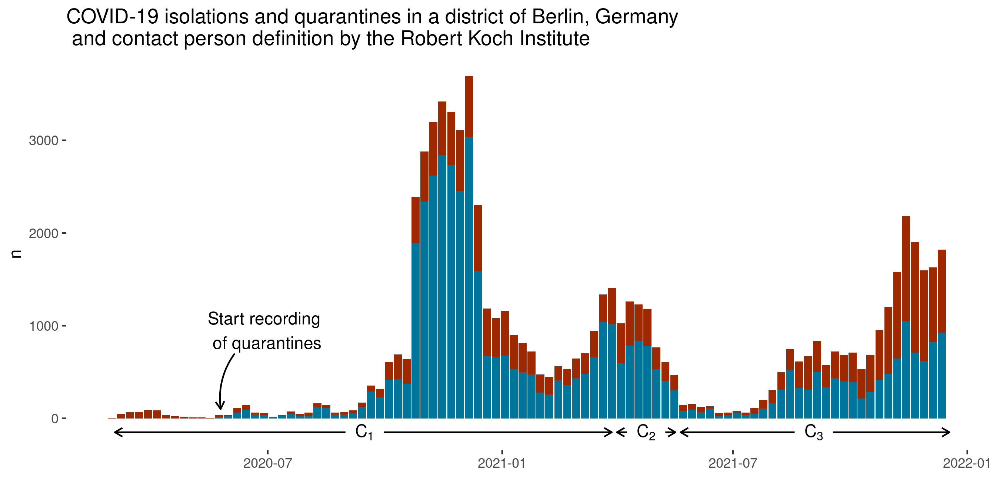
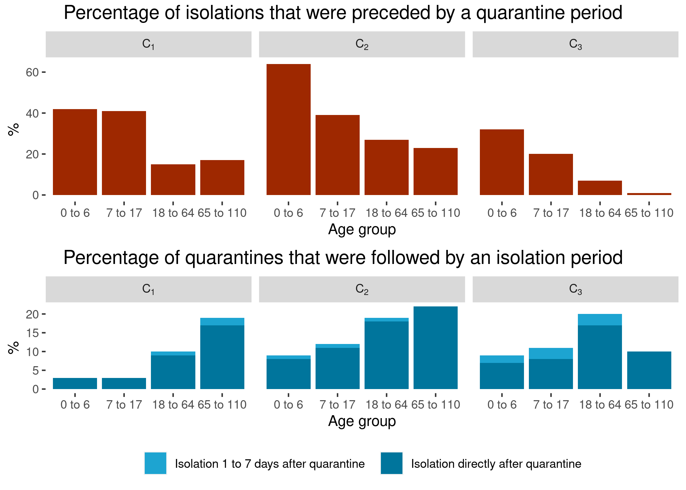
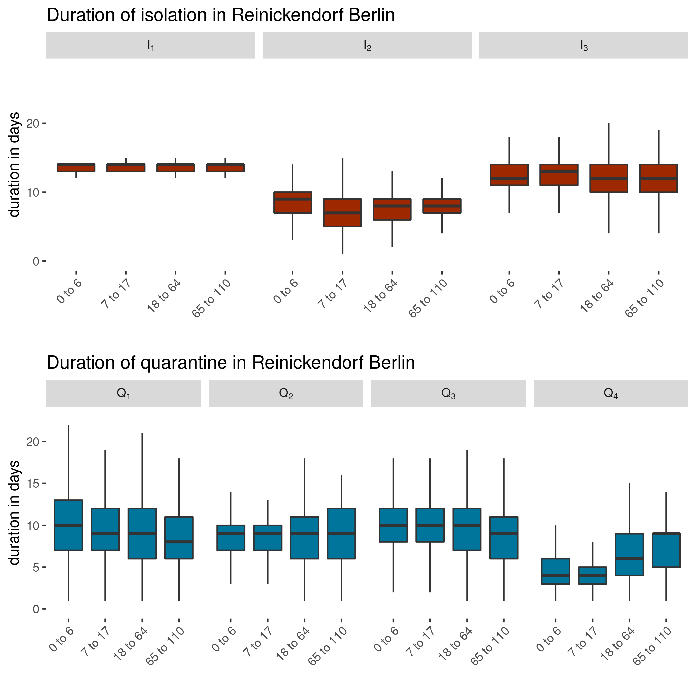

# About this repository
This repository shows the code and holds the data for the publication "COVID-19 isolation and quarantine orders in Berlin-Reinickendorf (Germany): How many, how long and to whom?". 


```{r Setting options for knitr ggplot , echo=FALSE}
# Disabeling scientific notation
options(scipen = 999)

# Create correct figure caption
knitr::opts_knit$set(eval.after = 'fig.cap')

# Adjust the big mark for large numbers
knitr::knit_hooks$set(inline = function(x) { prettyNum(x, big.mark=" ") })
```

# Understanding the R-Code
The following R-Code calculates all the necessary numbers and figures for the publication. All necessary files to reproduce are available. The analysis is done in R. This project uses Renv. See the file .Rprofile for used packages. This script runs with the package target. The important parts of the script lie in the functions in the code folder. You can check the file _targets.R to see the different steps in their sequential order. Use tar_make() to run the analysis.


# Code
## Reading data and filtering
```{r, code = readLines('code/reading_filtering_functions.R')}
```

## External input
```{r, code = readLines('code/external_input.R')}
```

## Cleaning and tidying data
```{r, code = readLines('code/transforming_functions.R')}
```

## Producing the results
```{r, code = readLines('code/calculating_results.R')}
```

## Creating graphs and tables
```{r, code = readLines('code/graphs_tables.R')}
```


# Results
```{r}
tar_read(results)
```


# Graphs



